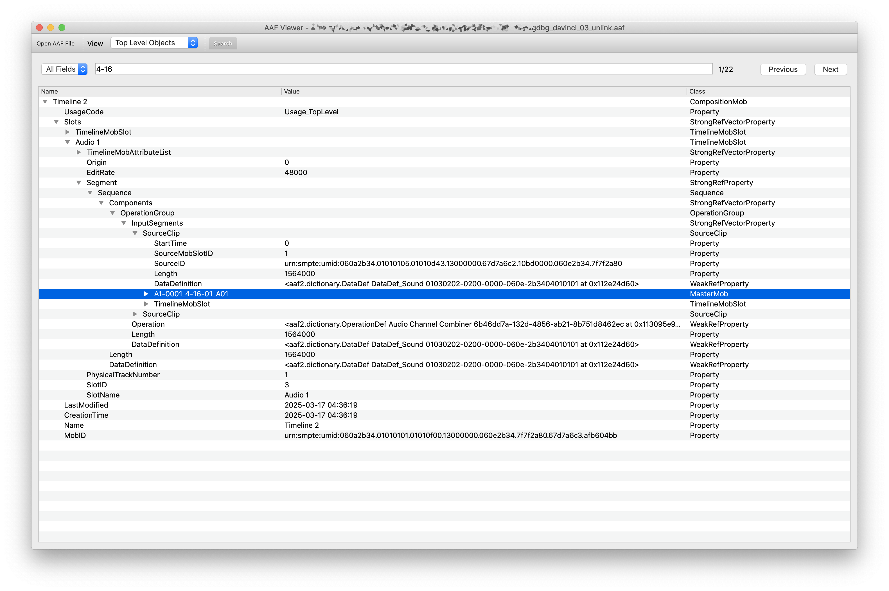

# AAF-Utilities

GUI Tools for Advanced Authoring Format (AAF) file handling. Focus on feature film workflow currently.
- **AAF Viewer**: Inspect AAF in various tree views, with a search tool to quickly locate desired mob. Based on [qt_aafmodel.py from pyaaf2](https://github.com/markreidvfx/pyaaf2/blob/main/examples/qt_aafmodel.py)

# Dependency

Use `pyaaf2` and `PySide2`. See `requirements.txt`.

# Roadmap
- **AAF Examiner**: Check if AAF and its essence have correct metadata for sound department.
- **AAF Reconformer**: Insert essence and related metadata into AAF for sound reconform purpose. Expect to realize some functions of the [EdiLoad](https://www.soundsinsync.com/products/ediload).
- **S3D-AAF Splitter**: Split Avid Media Composer stereoscopic AAF into individual left and right eye timeline(.otio/.aaf) for Baselight S3D workflow.

# Reference
## AAF and OMF Specs
- [AMWA AAF](https://www.amwa.tv/developers)
- [Just Solve OMF Archive](http://justsolve.archiveteam.org/wiki/OMF_Interchange)

## iXML Audio Metadata
- [Gallery.co.uk](http://www.gallery.co.uk/ixml/)

## Code Library
- [LibAAF](https://github.com/agfline/LibAAF)
